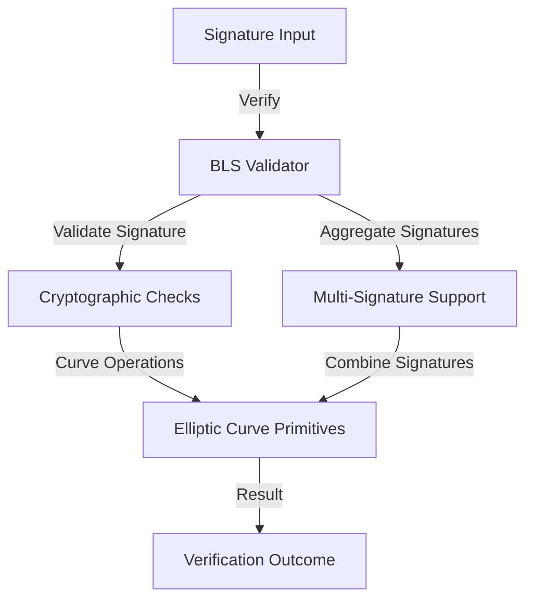

# Ultra BLS Interpreter

A robust Clarity smart contract for advanced BLS (Boneh-Lynn-Shacham) signature verification and interpretation on the Ultra blockchain.

## Overview

Ultra BLS Interpreter provides a comprehensive solution for:
- Cryptographically secure signature validation
- Flexible BLS signature interpretation
- Decentralized signature verification primitives
- Minimal gas consumption signature operations

### Key Features
- High-performance BLS signature verification
- Multi-point signature aggregation
- Customizable signature validation schemes
- Low-overhead cryptographic operations
- Secure multi-signature support

## Architecture

The Ultra BLS Interpreter is designed as a modular, efficient cryptographic utility for blockchain applications.



### Core Components
- BLS Signature Verification
- Signature Aggregation
- Curve Point Validation
- Error Handling and Reporting

## Contract Documentation

### bls-interpreter-core.clar

The primary contract implementing BLS signature interpretation and validation.

#### Key Data Structures
- Signature validation parameters
- Multi-signature aggregation support
- Error handling and reporting mechanisms

#### Access Control
- Signature verification: Public
- Cryptographic operation validation
- Minimal state mutation

## Getting Started

### Prerequisites
- Clarinet
- Understanding of BLS cryptography
- Ultra blockchain environment

### Installation
1. Clone the repository
2. Install dependencies
3. Deploy contract to desired network

### Basic Usage

1. Verify a single signature:
```clarity
(contract-call? .bls-interpreter-core verify-signature 
    public-key 
    message 
    signature)
```

2. Aggregate multi-signatures:
```clarity
(contract-call? .bls-interpreter-core aggregate-signatures 
    signature-list)
```

## Function Reference

### Signature Verification

```clarity
(verify-signature 
  (public-key (buff 33)) 
  (message (buff 32)) 
  (signature (buff 64)))
```

```clarity
(verify-multi-signature 
  (public-keys (list 10 (buff 33))) 
  (message (buff 32)) 
  (signatures (list 10 (buff 64))))
```

### Signature Aggregation

```clarity
(aggregate-signatures (signatures (list 10 (buff 64))))
(verify-aggregated-signature (aggregated-signature (buff 64)))
```

## Development

### Testing
Run tests using Clarinet:
```bash
clarinet test
```

## Security Considerations

### Cryptographic Limitations
- Curve-specific validation constraints
- Signature length and format requirements
- Computational complexity of BLS operations

### Best Practices
- Validate all input parameters
- Use canonical signature representations
- Implement comprehensive error checking
- Consider gas limit implications
- Regularly update cryptographic parameters

## Performance Notes
- Optimized for minimal computational overhead
- Designed for efficient signature verification
- Supports various signature schemes